# videoconf-frontend

## Quickstart

### Videoconf capabilities:

- Work with the Voximpant platform
- Create conferences
- Join existing conferences
- Choose audio and video devices during conferences
- Disable microphone and camera during conferences
- Screen sharing in several modes: screen+audio+camera+microphone, screen+camera+microphone, screen+microphone
- User reactions
- Create conference chats
- Display conference participants
- Request suitable video resolution from the server
- Sign up and sign in to videoconf via google account
- Customize video layouts and create your ones via [@voximplant/tiler](https://github.com/voximplant/tiler)
- Customize conference participants' order
- Notify users of devices errors

Signing up and signing in are processed via a backend server.

### Backend deployment and setup

The backend server provides signing up/signing in and other information for the client.  
[videoconf-backend project and documentation](https://github.com/voximplant/solutions-videoconference/tree/master/backend).

#### .env file configuration

- Fill in the service account to the SERVICE_ACCOUNT_CREDS field. Read more about service accounts [in this article](https://voximplant.com/docs/gettingstarted/basicconcepts/managementapi)
- Fill in the application ID to the APPLICATION_ID field. You can find the ID in the [applications](https://manage.voximplant.com/applications) section under your application name

To set up `web oauth config`, go to the [google oauth credentials](https://console.cloud.google.com/apis/credentials) section, choose "Create credentials", and "OAuth client ID".
After creating your credentials, you can view them via clicking the «Edit OAuth client» button.
- Fill in your Client ID to the GOOGLE_AUTH_CLIENT_ID field
- Fill in your Client's secret key to the GOOGLE_AUTH_SECRET field
- Fill in your authorization URI to the GOOGLE_AUTH_REDIRECT_URI field. The redirect can be `{{frontend}}/auth-endpoint` or `http://localhost:8080/auth` for local developments

#### Local deployment

Install modules and dependencies:

```
yarn 
```

Start production build in pm2

```
yarn start:pm2
```

#### Docker deployment

##### Build and push the docker image

- run `make docker-build`
- run `make docker-push`

##### Run on a server

- fill in the private keys into the `.private` folder
- fill in the environment variables to `.env` (check `.env.example`)
- log in to the docker registry `registry.zingaya.com/video/videoconf-backend` via `docker login` or `make docker-login`
- run `docker compose up -d`

#### Available endpoints

`/get-vox-token`
- POST `/get-vox-token`
- returns voximplant-app user's one-time-token and user data
- only for authenticated users
- Body (application/json):
    - one_time_key - return the one time token in the `ott` field and the `user` data

`/users/:userName`
- method `GET`
- returns users' info by name
- only for authenticated users

### Scenario setup

#### Application and scenario creation

Log in to your Voximplant account [here](https://manage.voximplant.com/auth). Select "Applications" in the left menu, and click "Create" to create an application. Then, create a scenario for your conference. Read more about scenarios in Voximplant [here](https://voximplant.com/docs/gettingstarted/makeanapp/voxengine).  
(as this scenario implies a conference without PSTN phone numbers, you don't need to buy a phone number)

#### Complete scenario

```javascript
// load the conference module and define variables for a conference and participants' counter
require("conference");
let conf;
let log;
let partsCounter = 0;
// add a handler for the very first call which creates a conference
VoxEngine.addEventListener(AppEvents.Started, function (event) {
    log = event.logURL;
    conf = VoxEngine.createConference({hd_audio: true});
    conf.addEventListener(ConferenceEvents.Stopped, function (event2) {
        Logger.write('Conference was stopped!');
        VoxEngine.terminate();
    });
    conf.addEventListener(ConferenceEvents.Started, function (event2) {
        Logger.write(`Conference is started ID: ${event2.conference.getId()}`);
    });
});
// create another handler for further incoming calls. The handler answers a call and connects it to the conference
VoxEngine.addEventListener(AppEvents.CallAlerting, function (e) {
    e.call.answer();
    e.call.sendMessage(log)
    partsCounter = partsCounter + 1;
    const endpoint = conf.add({
        call: e.call,
        mode: "FORWARD",
        direction: "BOTH", scheme: e.scheme
    });
    Logger.write(`New user ${e.callerid} was added as endpoint ID: ${endpoint.id()}`);
    e.call.addEventListener(CallEvents.Disconnected, function (event2) {
        partsCounter = partsCounter - 1;
        if (partsCounter === 0) {
            setTimeout(checkForTermination, 1000 * 10); // wait for 10 ceconds
        }
    });
});
// create a function which stops a conference if there are no participants:
function checkForTermination() {
    if (partsCounter === 0) {
        conf.stop();
        conf = null;
    }
}
```

### Client deployment and setup

#### Frontend development tools

We used the following frameworks in the videoconf-frontend:
- [Vue 3](https://vuejs.org/guide/introduction.html) for implementing the GUI
- [Effector](https://effector.dev/docs/glossary) for implementing business logic

#### Configuration file configuration

To start videoconf, configure the paths for the server and the google web oauth.  
You can do this in the `client/src/config.ts` configuration file.
- baseUrl: your application URL
- voxAppDomain: your application name, you can see it in the [application list](https://manage.voximplant.com/applications)
- baseServerUrl: your backend server root url
- baseAuthRedirectUrl: google account URL for user sign-in/sign-up
- clientId: web oauth client ID, you can find it in the [web oauth settings](#env-file-configuration)

#### Commands for videoconf-frontend build and development

1. Install modules and dependencies

```
yarn install
```

2. Build the project and track changes during the development

```
yarn serve
```

3. Build and minimize production

```
yarn build
```

### Run your end-to-end tests

```
yarn test:e2e
```

### Lints and fixes files

```
yarn lint
```

### Customize configuration

See the [configuration reference](https://cli.vuejs.org/config/).

## UI customization

Videoconf is based on the [SpaceUI](https://www.npmjs.com/package/@voximplant/spaceui) library.
Here you can learn how to customize the library's UI components as you need.

### UI base customize

Let us try to customize the Button component.

For example, you want to customize the Invite button:

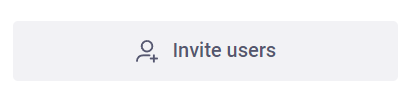

Here is what the component looks like (ContactList.vue):

```vue
Button.copy-link-btn(
  :icon="{ spriteUrl: '/image/videoconf-icons.svg', name: 'ic25-add-user', color: '--sui-gray-700'}"
  width="fill-container"
  height="48px"
  mode='secondary'
  size="l"
  @click="openPopup"
) {{ t('invitePeople.invite') }}
```

`Button` is a SpaceUI component, and `.copy-link-btn` is a CSS class. The component's properties and the HTML attributes are set in brackets. You can find the list of available properties in the `spaceui.d.ts` file within the SpaceUI folder inside the node_modules.

Let us find the Button class:

```ts
export declare class Button extends Vue {
  size?: ButtonSize;
  width?: ButtonWidth;
  icon?: IconProp;
  mode: ButtonMode;
  loading?: boolean;
  hideText?: boolean;
  // default slot
  default?: string;
}
```

The properties are:
- `size` - specifies the button's size. It accepts the following values: `s` - small, `m` - medium, `l` - large
- `width` - specifies the button's maximum width and accepts the following values:  
  1)`fill-container` - the button takes full container size  
  2)`fit-content` - the button adjusts to fit the content
- `icon` - specifies the button's icon (you need to place the icon to an SVG-sprite)

Find the `IconProp` type to learn what values it accepts:

```ts
export type IconProp = string | Icon;
```

Then find the `Icon` class. It accepts the following object:

```ts
export declare class Icon extends Vue {
  spriteUrl?: string;
  name: string;
  color?: string;
  size?: string | number;
  width?: string | number;
  height?: string | number;
}
```

`spriteUrl` accepts the path to the SVG-sprite
`name` accepts the icon id

Other `Button` class properties:

- `height` - HTML height attribute
- `mode` - specifies the color scheme. For example, if you substitute the `warning` value, the button becomes red, and if you substitute the `flat` value, the button becomes transparent.
- `loading` - enables the loader animation
- `hideText` - hides the button text
- `default` - shows that we can use the slot. It is necessary if you want to put a separate HTML element inside the button (e.g. div, p, span) and assign a CSS class to it; or if you want to put another component inside the button.

You can also use Vue directives, such as v-if, v-for, v-on, etc. In our example, the button has the directive `@click="openPopup"`. You can add event listeners (click, keyup, submit, etc).  
`openPopup` - is the button's event handler function. You can add additional functionality to the function, for example, sending statistics to your backend. Alternatively, you can create a decorator for the `openPopup` function and call it an event handler.

Let us try to change the button handler:

```vue
Button.copy-link-btn(
  :icon="{ spriteUrl: '/image/videoconf-icons.svg', name: 'ic25-hand', color: 'red'}"
  width="fit-content"
  height="48px"
  mode='outlined'
  size="s"
  @click="openPopup"
) I am button
```

This is what the button looks like now:  
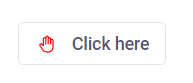

To stylize the text, use slots:

```vue
Button.copy-link-btn(
    :icon="{ spriteUrl: '/image/videoconf-icons.svg', name: 'ic25-hand', color: 'red'}"
    width="fit-content"
    height="48px"
    mode='outlined'
    size="s"
    @click="openPopup"
)
  .unic-class
    p.big I am
    | &nbsp
    span.red  button
```

Let's add some CSS.  
You can add style sheets at the bottom of the component in the `<style scoped>` tag. The scoped attribute means that all the styles are applied within the current component only (currently ContactList.vue):

```postcss
.unic-class {
    display: flex;
    .big {
      text-transform: uppercase;
      font-weight: bold;
    }
    .red {
      color: red;
    }
}
```

This is what the button looks like now:  
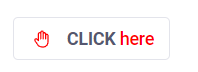

If the [SpaceUI](https://www.npmjs.com/package/@voximplant/spaceui) customization abilities are not enough, you can add your CSS class to the Button component and create your styles.  
Let us add a custom `new-class` class and create custom styles.

```vue
Button.copy-link-btn.new-class(...
```

```postcss
.new-class{
    background-color: greenyellow;
    border-radius: 20px;
  }
```

This is what the button looks like now:  
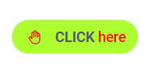

Now let us modify the button's event handler `openPopup`.  
Now it looks like this: `const openPopup = () => toggleInvitePopup(true);`

Let us create an abstract function that sends some data to a server:

```vue
const getData = (async () => {
    const response = await fetch(`https://website.com/api`, {
      method: 'POST',
      body: data
    });
    const json = await response.json();
    if (response.status !== 200) throw Error(json.message);
    return json;
});
```

Let us add the `openPopup` function to it:

```vue
const openPopup = () => {
    getData()
    return toggleInvitePopup(true)
};
```

Now, this button not only opens the invitation popup but also sends data to a server.

### UI advanced customization

If you do not like an existing UI component, you can create your own.

For example, this is Message.vue:  
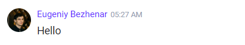

Here is its usage:

```vue
Message(
  v-for="item of chatList"
  :name="item.name"
  :time="item.time"
  :avatar="item.avatar"
  :message="item.message"
  :isPrivate="false"
)
```

You can track that `chatList` receives data from the `client/src/store/chat.ts` file, where the `messages` array is declared:

```vue
interface ChatStore {
  currentConversation?: Conversation; // contain current data of the current conversation
  messages?: Message[]; // contain current list of messages and reaction with a sender info
}

interface Message {
  name: string;
  time: string;
  avatar: string | undefined;
  message: string;
}
```

Now we know what content can be displayed in the component. Let us create a `NewMessage.vue` component and write a custom layout with styles, and accept an `item` property with the `MessageItem` type, which we import from `chat.ts`.

Here is what the component template looks like:

```vue
<template lang="pug">
  .message
    .info-wrap
      img.avatar(:src="item.avatar" :alt="item.name")
      .name-wrap
        p.name {{ item.name }}
        p.time {{ item.time }}
    .message-wrap
      p.text {{ item.message }}
</template>
```

For example, you want to improve the standard functionality and visually divide your messages from others' messages. Here is how you can achieve this.

The current user data is stored in `$users`.

```vue
setup(props) {
    const users = useStore($users);
    const isLocal = computed(() => users.value.me?.chatUser.displayName === props.item?.name);
    return {isLocal, users}
}
```

We address the `$users` store within the `client/src/store/users.ts` file and put the current store state to the `users` variable. When the store updates, the variable updates, too. `isLocal` is a common getter, which can address the store each time when a new message appears, and check if the sender's name corresponds to the current user name. If it does, it marks it with the `isLocal = true` flag and adds a new CSS class, which highlights the message in blue.

Let us add a dynamic class to the template:

```vue
<template lang="pug">
.message(:class="{local: isLocal}")
  .info-wrap
    img.avatar(:src="item.avatar" :alt="item.name")
    .name-wrap
      p.name {{ item.name }}
      p.time {{ item.time }}
  .message-wrap
    p.text {{ item.message }}
</template>
```

Here is what it looks like now:  
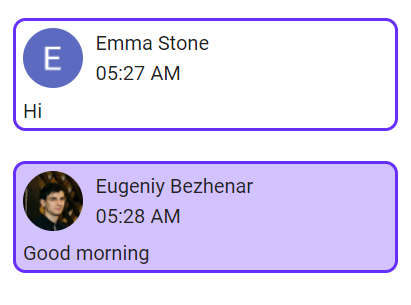  
As you can see, your messages are highlighted in blue.

Thus, you can rewrite any component the way you like, and change the appearance and functionality.

## Video layouts management

There are 3 layout types in the current project version. You can find them in the `client/src/helpers/layouts` folder. The `index.ts` file initializes the layout types and provides tools to work with them.

### Layout processing scheme

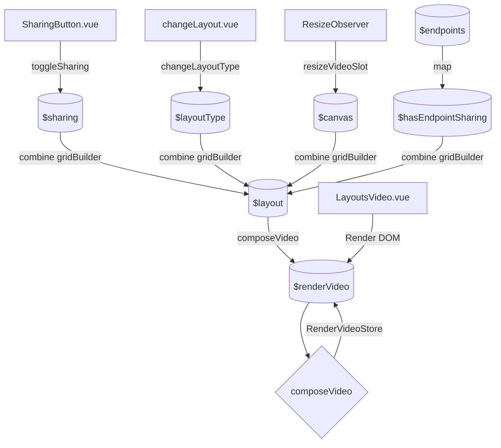

#### store

`$sharing` contains the information about local user's screen sharing
`$layoutType` contains the information about the current layout (grid by default)
`$canvas` contains the information about the current nest size
`$hasEndpointSharing` defines the screen sharing presence flag for conference participants
`$layout` contains the grid and conference participants' video options

#### event

`toggleSharing` triggers when screen sharing toggles, for example, when a new screen sharing is added (addSharing event)
`changeLayoutType` triggers when a participant changes its layout
`resizeVideoSlot` triggers when a video nest changes its resolutions or when ResizeObserver triggers in LayoutsPanel.vue

#### combine function

`gridBuilder` returns a layout from a `gridList` depending on the incoming data from the store:
- presence of screen sharing
- video nest resolution
- layout type

`composeVideo` sends the generated layout settings from `$layout` to the tiler and returns a grid.

#### Scheme description

`$layout` stores the grid configuration options and the participants' priorities.  
These options are declared in constants and stored in `$layout` depending on the layout usage conditions.

### Conference layout definition

Layout building options are stored in `$layout` and defined via the `gridBuilder` method.  
The method's result depends on 3 major criteria:

1. Video nest resolution. Depending on the resolution, the `getScreenKind` function returns the screen type:
- large (width >= 1920 && height >= 1080)
- mobile (height > width)
- default (if not large or mobile)

2. Presence of screen sharing in the conference. If a screen sharing is detected while receiving the grid type, the `Screen` option appears in the `GridKind` function.  
   In this case, the grid type returns `mobileScreen` instead of `mobile`.

3. User's layout type. This value is stored in `$layoutType`. A user can change the layout type at the start or during the conference. When it happens, the `changeLayoutType` event triggers in the changeLayout.vue component.

Based on these 3 criteria, the `gridBuilder` method returns the `gridList` object, where the key is the current layout type, and the property name contains the video nest resolution and the presence of screen sharing.

### Reordering participants within a layout

Layout reordering functions are located in the `client/src/helpers/layout-reordering` folder.  
Grid reordering parameters are located in the `reorderTiles` option and used during the grid creation.

#### 1. Participants reordering function

Each layout file has the `ReorderFunction` function which returns the `reorderByVad` function. It manages participants reordering according to the `$conferenceEndpointsState` store by VAD (voice activity detection). To fix the local video, use the `fixLocalVideo` function.

#### 2. The process of reordering participants

You can reorder participants according to the `$conferenceEndpointsState` store's VAD parameter. The participants' order is defined by triggering the following events: `[ConferenceEvents.vad, ConferenceEvents.mute]`. These events trigger when you toggle/activate the microphone and update the store. Reordering via VAD parameter can happen only within one grid, by changing the priority property. If you want to show the local video with the highest priority, change the `fixLocalVideo`'s position parameter to `"first"`.

### Grid overflow checkpoints

Grid overflow checkpoints for each grid type are stored in the `overflowCheckpoint` constant within the `client/src/helpers/layouts/index.ts` file. If you try to fit more participants than the grid allows, you will get a `usersOverflowMock.vue` for each overflown participant. They contain avatars of the overflown participants (up to 3 people) and the number of overflown participants. You can check if a participant fits in a certain grid in the `VideoSlot.vue` file.

### Layout types and descriptions

#### Grid

All participants have the same size video nests and are displayed one by one. The maximum video nest count is stored in the `overflowCheckpoint.grid` constant within the `index.ts` file.

When a participant shares their screen, the screen sharing takes 85% of the screen width. All the participants are displayed as a column of 15% of the screen width to the right (up to 5 participants) and a placeholder for the overflown participants.

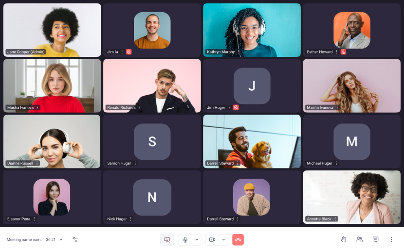

#### Tribune

The screen is divided into two areas. The first area takes 70% of the screen width and displays 4 active participants. The rest participants are displayed as a column of 30% of the screen width and a placeholder for the overflown participants.

When a participant shares their screen, the screen sharing takes 85% of the screen width. All the participants are displayed as a column of 15% of the screen width to the right (up to 5 participants) and a placeholder for the overflown participants.

#### Demonstration

The first participant's video takes the whole screen. The second participant's video is displayed at the right bottom corner of the screen on top of the first participant's video with a 29x25% of image size.  
If there are more than two participants, a placeholder with information and the participants' count is displayed instead of the second participant's video.

When a participant shares their screen, the screen sharing takes the whole screen. The participant's count is displayed in the right bottom corner.


### How to create a custom layout

- create a file with your layout name and place it in the `client/src/helpers/layouts` folder
- create constants for layout building options. Read more in the [@voximplant/tiler documentation](https://github.com/voximplant/tiler#quickstart)
- create a `TileInterface` format map, which contains layout building options
- if you need to reorder participants within a grid, prepare a grid reordering function with `ReorderFunction`, where you can implement participants reordering logic
- export the function responsible for returning grid settings and reordering logic, for example, `createGridLayout`
- add your grid to LayoutTypeMap
- add a special property to `gridList`, where the key is `[LayoutTypeMap.yourLayout]`, and the value is the function responsible for returning grid settings and reordering logic
- add a special property to `overflowCheckpoint`, where the key is `[LayoutTypeMap.yourLayout]`, and the value is the overflow points for each layout type

### How to delete a layout

- delete the layout from the `LayoutTypeMap` constant
- delete the TS file from the `client/src/helpers/layouts` folder
- delete the overflow checkpoints from the `overflowCheckpoint` constant
- delete the layout from the `gridList` constant
- delete the layout and its description from the `layoutItemsMobile` and `layoutItems` constants within `ChangeLayout.vue`

### How to customize an existing layout

Let us take a look at layout customization with several examples:

1. If you need to limit the participant number in the main section to 1:
- find the layout file, which contains the `client/src/helpers/layouts/tribune` grid options
- find the constant with the necessary grid type, for example, `tribuneDefault`
- find the first section in the grid building option (priority: 1)
- find the grid property
- delete 2,3,4 participants processing, leaving only 1 object:  
  `{ fromCount: 1, toCount: 1, colCount: 1, rowCount: 1, margin: 12 }`
- change the participants overflow checkpoint value in `overflowCheckpoint.[LayoutTypeMap.tribune].default` to 5 (1 participant from `priority: 1` and 4 participants from `priority: 2`)

Done. Now the first section has 1 participant only and the rest participants are in the column to the right.

2. If you want to limit the grid layout participants to N:
- find the layout file, which contains the `client/src/helpers/layouts/grid` grid options
- find the constant with the necessary grid type, for example, `grideMobile`
- find the grid property
- delete the excess objects, leaving only N objects you need:

```javascript
grid: [
        { fromCount: 1, toCount: 1, colCount: 1, rowCount: 1, margin: 0 },
        { fromCount: 2, toCount: 2, colCount: 1, rowCount: 2, margin: 5 },
        { fromCount: 3, toCount: N, colCount: 2, rowCount: 2, margin: 5 }
]
```

- change the participants overflow checkpoint value in `overflowCheckpoint.[LayoutTypeMap.grid].default` to N

Done. Now in the mobile version, there are only N participants displayed, and if there are more participants, a placeholder with the number of overflown participants appears.

## Mirror store

Mirror store processes local media: audio and video.

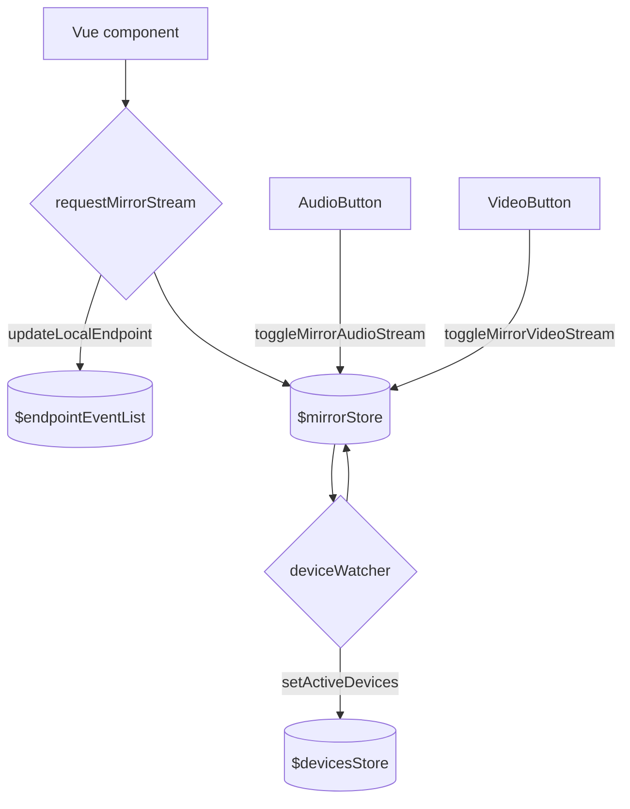

Call `requestMirrorStream` to get tracks from local audio and video devices. It also processes possible errors, device changing, and microphone activity visualization. Call it each time you need to change the camera/microphone/headphones before or during a conference.

Call `toggleMirrorAudioStream` each time you mute/unmute the microphone for conference participants.

Call `toggleMirrorVideoStream` each time when you enable/disable the local camera device. Sending video streams to conference participants depends on this event.

## Device store

This store processes the information about all the available local media devices, all the active media devices, and the information on the current local audio/video stream and its quality. If you need to get all user devices, change the microphone, speaker, or camera, mute audio or disable the local camera, take a look at the following events.

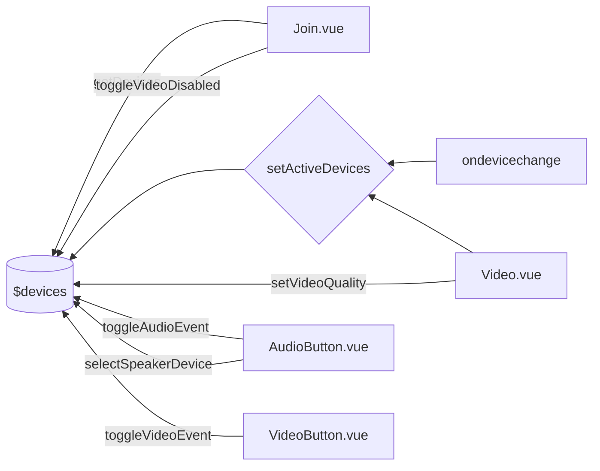

The `getDevices` event returns all available user devices, such as the microphone, speaker, and camera. This event also specifies the default and active system devices.  
The `setActiveDevices` event updates the information about active devices but does not change the media stream. To change the media stream, use `requestMirrorStream`.  
To change the speaker device, use the `selectSpeakerDevice` event. It updates the store and changes the current user's speaker.  
This store also processes connecting new system devices and disconnecting the existing ones. When you connect a new sound device during a conference, the store chooses it as the active one. When you disconnect an active sound device during a conference, you need to choose a new one from the existing device list. When you connect a new camera during a conference, the store just updates the device list but does not choose the device as the active one. When you disconnect a camera during a conference, the store stops sending the video stream.

The `toggleAudioEvent` and `toggleVideoEvent` events process the microphone and camera usage status accordingly. To toggle the microphone and camera, use the `toggleMirrorAudioStream` and `toggleMirrorVideoStream` events.

The `toggleVideoDisabled` event allows developers to disable a participant's camera permanently, in case of camera unavailability.
`setVideoQuality` allows developers to choose the video quality for outbound video. If you choose the quality lower than 480p, the simulcast will be disabled.

## Chat store

The $chatContent store generates the conference ID and stores the information about the current conversation and its messages.
Additionally, it provides the ability to send user reactions.

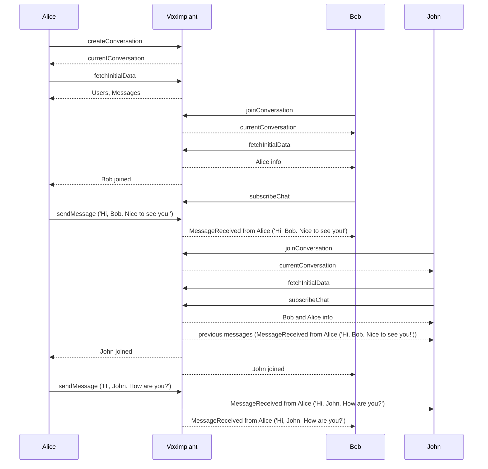

To start a chat, create a new conversation via the `createChat` event, or join an existing chat via the `joinChat` event. These events return the current conversation, but you need to additionally call the `fetchInitialData` event to retrieve all existing participants and messages.

The `subscribeChat` event subscribes to the conversation events, such as receiving new messages, adding new participants, and others.  
To send a message into the conversation, call the `sendMessageToAll` event.
Call the `updateChatContent` event to update the chat after some changes happen, like receiving a new message or a reaction.

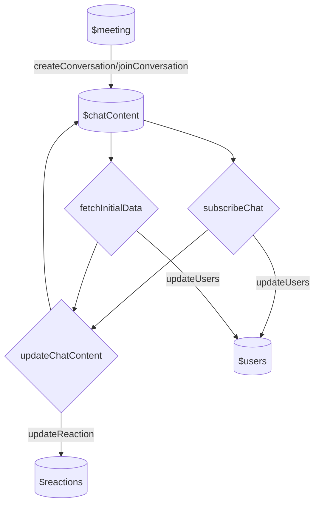

After finishing the conference, you need to clear the store via the `clearChat` event, which unsubscribes from all the events and cleares the store.
